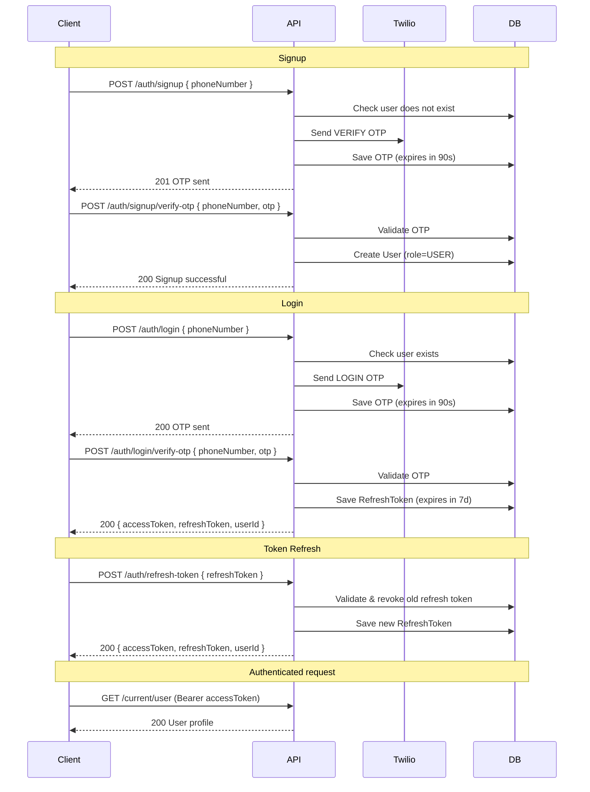

# Auth API Documentation

Authentication is **phone number + OTP only**. There is no email/password or OAuth login.

- OTPs are sent via **Twilio SMS**
- OTP validity: **90 seconds**
- Access token (JWT) expiry: **1 day**
- Refresh token expiry: **7 days** (opaque, stored server-side, rotated on every use)
- New users are assigned the **`USER`** role on signup

---

## Base URL

```
http://localhost:8081
```

Replace with your deployed host when not running locally.

---

## Phone Number Format

| Rule | Details |
|------|---------|
| Format | E.164 recommended (e.g. `+919876543210`) |
| Validation | `^\+91[6-9]\d{9}$` |
| Normalization | If `+91` is omitted, the server prepends it |

---

## Authentication

Protected endpoints require a JWT **access token** in the request header:

```
Authorization: Bearer <accessToken>
```

The access token is returned from **`POST /auth/login/verify-otp`** and **`POST /auth/refresh-token`**.

### JWT payload claims

| Claim | Description |
|-------|-------------|
| `sub` | User UUID |
| `phoneNumber` | User's verified phone number |
| `iat` | Issued at |
| `exp` | Expiration (1 day from issue) |

---

## Token Strategy

| Token | Type | Expiry | Storage advice |
|-------|------|--------|----------------|
| `accessToken` | JWT (signed HS256) | 1 day | Memory / secure storage |
| `refreshToken` | Opaque random string | 7 days | Secure storage (HttpOnly cookie or Keychain) |

**Rotation**: Every call to `/auth/refresh-token` **invalidates** the old refresh token and issues a brand-new pair. Store the latest tokens after each refresh.

---

## Endpoints Overview

| Method | Path | Auth required | Description |
|--------|------|---------------|-------------|
| `POST` | `/auth/signup` | No | Send signup OTP |
| `POST` | `/auth/signup/verify-otp` | No | Verify signup OTP and create account |
| `POST` | `/auth/login` | No | Send login OTP |
| `POST` | `/auth/login/verify-otp` | No | Verify login OTP → get access + refresh tokens |
| `POST` | `/auth/refresh-token` | No | Rotate refresh token → get new access + refresh tokens |
| `GET` | `/current/user` | Yes | Get logged-in user profile |

---

## Signup Flow

### Step 1 — Request signup OTP

**`POST /auth/signup`**

Sends a verification OTP to the given phone number. Fails if a user with that number already exists.

#### Request body

```json
{
  "phoneNumber": "+919876543210"
}
```

| Field | Type | Required | Description |
|-------|------|----------|-------------|
| `phoneNumber` | string | Yes | Phone number in E.164 format (`+91XXXXXXXXXX`) |

#### Success response — `201 Created`

```json
"OTP sent successfully"
```

#### Error responses

| Status | Condition | Example body |
|--------|-----------|--------------|
| `409 Conflict` | User already exists | `{ "timestamp": "...", "message": "User already exists with this phone number" }` |
| `409 Conflict` | Validation error | `{ "phoneNumber": "invalid phone number format" }` |

---

### Step 2 — Verify signup OTP

**`POST /auth/signup/verify-otp`**

Verifies the OTP and creates a new user with `isPhoneVerified: true` and role `USER`.

#### Request body

```json
{
  "phoneNumber": "+919876543210",
  "otp": "482913"
}
```

| Field | Type | Required | Description |
|-------|------|----------|-------------|
| `phoneNumber` | string | Yes | Same number used in signup |
| `otp` | string | Yes | 6-digit OTP from SMS (valid for **90 seconds**) |

#### Success response — `200 OK`

```json
"Signup successful"
```

#### Error responses

| Status | Condition | Example body |
|--------|-----------|--------------|
| `401 Unauthorized` | Invalid or expired OTP | `{ "timestamp": "...", "message": "Invalid or expired OTP" }` |
| `409 Conflict` | User already exists | `{ "timestamp": "...", "message": "User already exists with this phone number" }` |
| `409 Conflict` | Validation error | `{ "otp": "otp cannot be empty" }` |

---

## Login Flow

### Step 1 — Request login OTP

**`POST /auth/login`**

Sends a login OTP. The phone number must belong to an existing registered user.

#### Request body

```json
{
  "phoneNumber": "+919876543210"
}
```

| Field | Type | Required | Description |
|-------|------|----------|-------------|
| `phoneNumber` | string | Yes | Registered user's phone number |

#### Success response — `200 OK`

```json
"OTP sent successfully"
```

#### Error responses

| Status | Condition | Example body |
|--------|-----------|--------------|
| `404 Not Found` | User not registered | `{ "timestamp": "...", "message": "User does not exist, please sign up" }` |
| `409 Conflict` | Validation error | `{ "phoneNumber": "phone number cannot be empty" }` |

---

### Step 2 — Verify login OTP

**`POST /auth/login/verify-otp`**

Verifies the login OTP and returns a JWT access token + opaque refresh token.

#### Request body

```json
{
  "phoneNumber": "+919876543210",
  "otp": "482913"
}
```

| Field | Type | Required | Description |
|-------|------|----------|-------------|
| `phoneNumber` | string | Yes | Same number used in login |
| `otp` | string | Yes | 6-digit OTP from SMS (valid for **90 seconds**) |

#### Success response — `200 OK`

```json
{
  "accessToken": "eyJhbGciOiJIUzI1NiJ9...",
  "refreshToken": "dGhpcyBpcyBhIHNlY3VyZSByZWZyZXNoIHRva2Vu...",
  "userId": "a1b2c3d4-e5f6-7890-abcd-ef1234567890"
}
```

| Field | Type | Description |
|-------|------|-------------|
| `accessToken` | string | JWT — use in `Authorization: Bearer` header (expires in **1 day**) |
| `refreshToken` | string | Opaque token — use to get new tokens (expires in **7 days**, one-time-use) |
| `userId` | UUID | Authenticated user's ID |

#### Error responses

| Status | Condition | Example body |
|--------|-----------|--------------|
| `401 Unauthorized` | Invalid or expired OTP | `{ "timestamp": "...", "message": "Invalid or expired OTP" }` |
| `404 Not Found` | User not found | `{ "timestamp": "...", "message": "User does not exist, please sign up" }` |

---

## Refresh Token

### Rotate tokens

**`POST /auth/refresh-token`**

Exchanges a valid refresh token for a new access token + a new refresh token. The old refresh token is **immediately invalidated** (one-time-use rotation).

#### Request body

```json
{
  "refreshToken": "dGhpcyBpcyBhIHNlY3VyZSByZWZyZXNoIHRva2Vu..."
}
```

| Field | Type | Required | Description |
|-------|------|----------|-------------|
| `refreshToken` | string | Yes | The refresh token received from login or last refresh |

#### Success response — `200 OK`

```json
{
  "accessToken": "eyJhbGciOiJIUzI1NiJ9...",
  "refreshToken": "bmV3UmVmcmVzaFRva2VuVmFsdWVIZXJl...",
  "userId": "a1b2c3d4-e5f6-7890-abcd-ef1234567890"
}
```

| Field | Type | Description |
|-------|------|-------------|
| `accessToken` | string | New JWT — replaces the previous access token |
| `refreshToken` | string | New refresh token — **store this and discard the old one** |
| `userId` | UUID | User's ID |

#### Error responses

| Status | Condition | Example body |
|--------|-----------|--------------|
| `401 Unauthorized` | Token not found | `{ "timestamp": "...", "message": "Invalid refresh token" }` |
| `401 Unauthorized` | Token was already used/revoked | `{ "timestamp": "...", "message": "Refresh token has been revoked" }` |
| `401 Unauthorized` | Token expired (> 7 days) | `{ "timestamp": "...", "message": "Refresh token has expired, please log in again" }` |

> **Important**: After calling this endpoint, always save both the new `accessToken` and `refreshToken`. The previous refresh token can no longer be used.

---

## Current User

### Get authenticated user

**`GET /current/user`**

Returns the profile of the user associated with the JWT access token.

#### Headers

```
Authorization: Bearer <accessToken>
```

#### Success response — `200 OK`

```json
{
  "id": "a1b2c3d4-e5f6-7890-abcd-ef1234567890",
  "phoneNumber": "+919876543210",
  "phoneVerified": true,
  "createdAt": "2026-06-12T10:30:00",
  "role": "USER",
  "updatedAt": "2026-06-12T10:30:00"
}
```

| Field | Type | Description |
|-------|------|-------------|
| `id` | UUID | User ID |
| `phoneNumber` | string | Verified phone number |
| `phoneVerified` | boolean | Always `true` after signup |
| `role` | enum | `USER` or `ADMIN` |
| `createdAt` | datetime | Account creation time |
| `updatedAt` | datetime | Last update time |

#### Error responses

| Status | Condition |
|--------|-----------|
| `401 Unauthorized` | Missing, invalid, or expired access token |
| `404 Not Found` | User no longer exists |

---

## Error Response Formats

### Standard error (OTP, not found, token invalid)

```json
{
  "timestamp": "2026-06-12T10:30:00",
  "message": "Error description"
}
```

### Validation error

```json
{
  "phoneNumber": "invalid phone number format",
  "otp": "otp cannot be empty"
}
```

### HTTP status summary

| Status | Meaning |
|--------|---------|
| `200 OK` | Request succeeded |
| `201 Created` | Signup OTP sent |
| `401 Unauthorized` | Invalid/expired OTP, bad JWT, or invalid refresh token |
| `404 Not Found` | User does not exist |
| `409 Conflict` | Duplicate user or validation failure |

---

## Full Flow Diagram



---

## Example cURL Requests

### Signup

```bash
curl -X POST http://localhost:8081/auth/signup \
  -H "Content-Type: application/json" \
  -d '{"phoneNumber": "+919876543210"}'
```

```bash
curl -X POST http://localhost:8081/auth/signup/verify-otp \
  -H "Content-Type: application/json" \
  -d '{"phoneNumber": "+919876543210", "otp": "482913"}'
```

### Login

```bash
curl -X POST http://localhost:8081/auth/login \
  -H "Content-Type: application/json" \
  -d '{"phoneNumber": "+919876543210"}'
```

```bash
curl -X POST http://localhost:8081/auth/login/verify-otp \
  -H "Content-Type: application/json" \
  -d '{"phoneNumber": "+919876543210", "otp": "482913"}'
```

### Refresh tokens

```bash
curl -X POST http://localhost:8081/auth/refresh-token \
  -H "Content-Type: application/json" \
  -d '{"refreshToken": "<your-refresh-token>"}'
```

### Get current user

```bash
curl -X GET http://localhost:8081/current/user \
  -H "Authorization: Bearer <your-access-token>"
```

---

## Required Configuration

Set these in `application.properties` (or environment variables):

```properties
jwt.secretKey=your-secret-key-at-least-32-characters-long
twilio.account_sid=your-twilio-account-sid
twilio.auth_token=your-twilio-auth-token
twilio.trial_number=+1234567890
```

---

## Notes

- Signup and login use **separate OTP types** (`VERIFY` vs `LOGIN`); a signup OTP cannot be used to log in and vice versa.
- OTP SMS message format: `Your Badminton app verification code is: <6-digit-code>`
- Expired OTPs and refresh tokens are cleaned up daily at **2:00 AM** by a scheduled job.
- Refresh tokens are **one-time-use** — each call to `/auth/refresh-token` issues a new pair and revokes the previous refresh token. If the same refresh token is used twice, the second call will return `401 Refresh token has been revoked`.
- If the refresh token expires (after 7 days), the user must log in again via OTP.
